# IntegriGrade 
## Description
IntegriGrade is a convenient **grade and progress reporting system** used in a school setting to allow teachers to post student grades and progress report for guardians to receive fisthand information about how their dependants are doing and students to see their progress.

## Contributors
1. Dennis Karanja
2. Lisa Muiruri

## View the Live Site
View the deployed site at: [Integrade](https://integrigrade-report-system.onrender.com)

## Screenshots and Features
### Homepage
Through the homepage, a user may select through some buttons which of the following roles they are: A Classteacher,student, guardian or a teacher. 

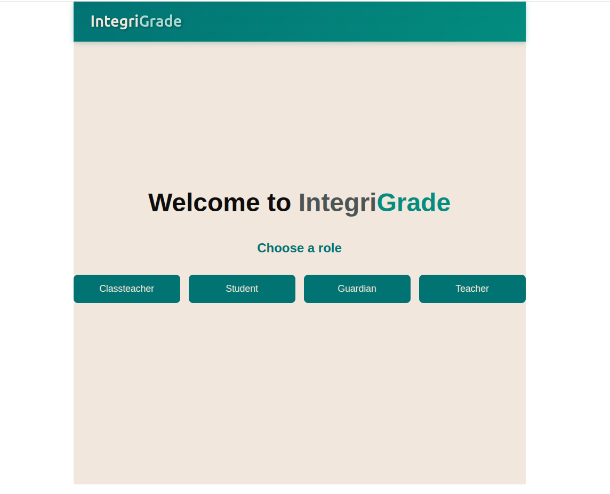

### 1. ClassTeacher role
Once the classteacher button is clicked on the homepage, it reroutes the user to a **classteacher Login**. A classteacher does not signup but is added directly to the backend

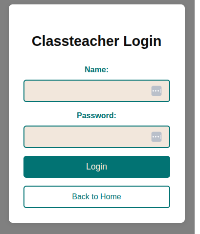

For testing purposes one can login using username **Anne Wanjiku** and the password is **classteacher**
Once successfully logged in, a teacher may view all their students and their guardian, subjects and general details

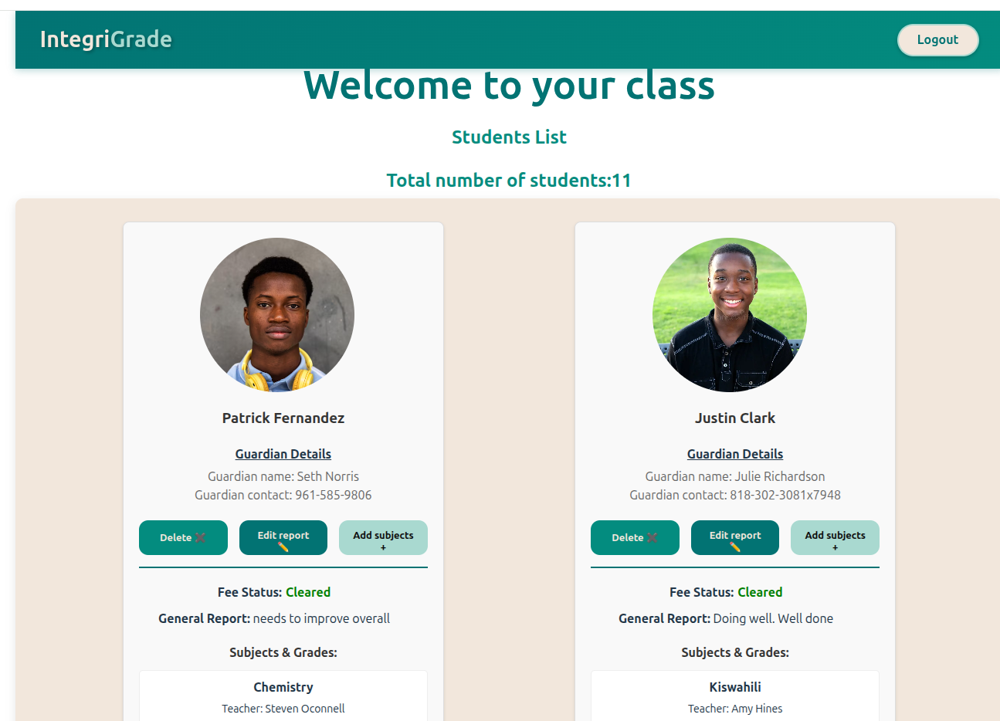

Each student card has three buttons. The **delete button** removes a student from a class, the **edit button** opens a form that is used to update the fee stuatus and  general report of a student. The **add subject button** opens a form to create a new subject for a student and assign them a teacher
A class teacher may logout through the logout button that reroutes them to the class teacher login form.
### 2. Student role
Once a user clicks the student button in the homepage, he is routed to a **student login form**. A student can also signup through the **student signup form**

|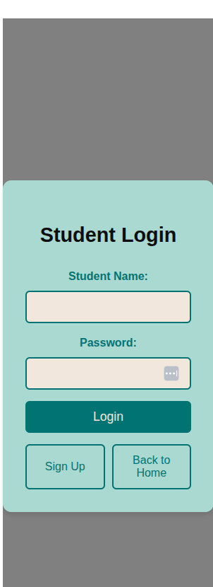 |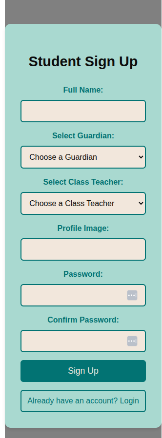 |

For the sake of testing, one may login using username **Charlie Kirk** and password **student**

Once logged in, a student may view all his grades and his other details. Through the **Update profile** button, a student may access a form to change their profile details. Once logged out a student is rerouted to the Home Page

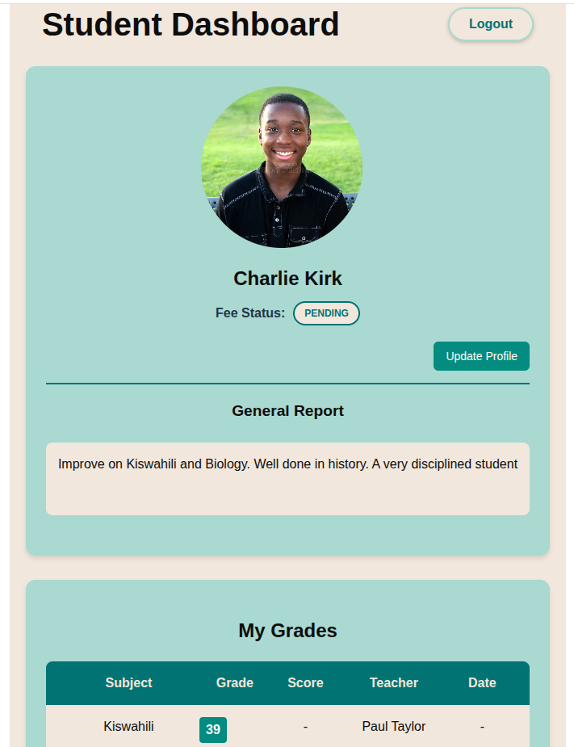

### 3.Guardian Role
Once a user clicks the guardian button in the homepage, he is routed to a **guardian login form**. A guardian can also signup through the **guardian signup form**

| | 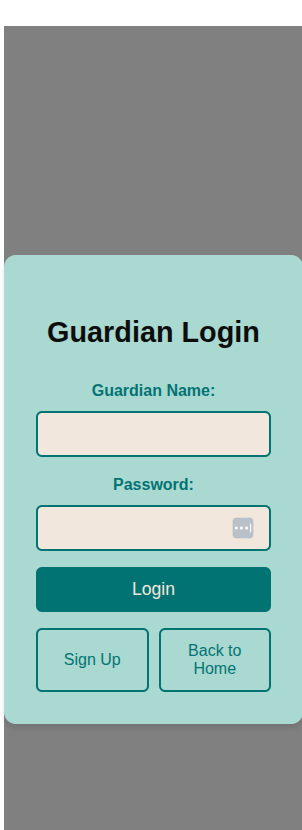 |

For the sake of testing a user can use username **Andrew Kibe** with the password **guardian**

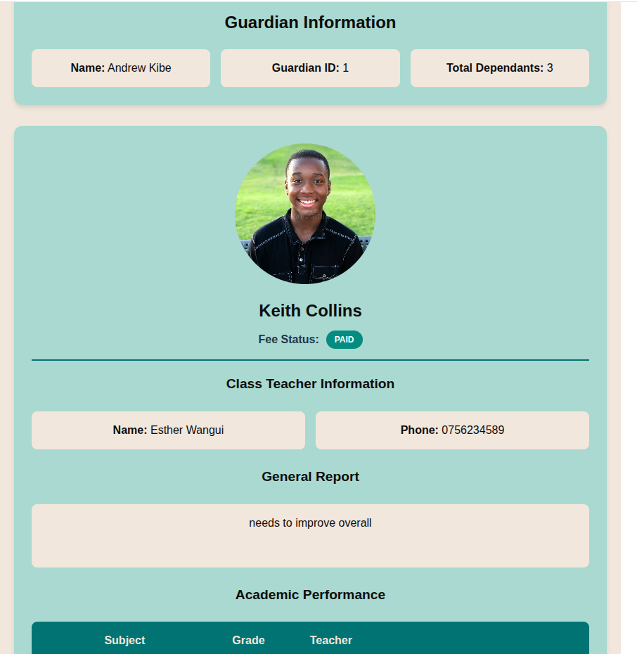

Once logged in, a guardian can **view all their dependants and their details** including their fee status, class teacher details and their progress and academic reports. A guardian can also logout through the logout button at the top right of the screen. On logging out, a guardian is rerouted to the home page.
### 4. Teacher role
Once a user clicks the teacher button in the homepage, they are routed to a **teacher login form**. A teacher can also signup through the **teacher signup form**

|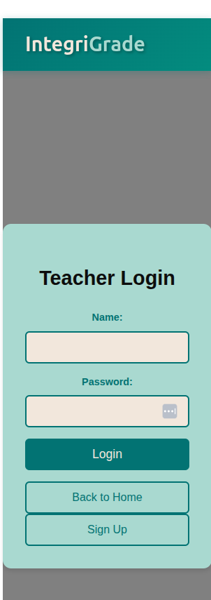 | 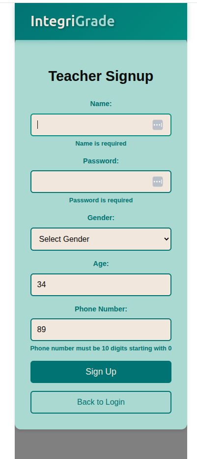 |

For the sake of testing, a user can login with username **Jane Wambui** with the password **teacher**

Once Logged in, a teacher may view **all their students with the details of the subject they teach the student**. 

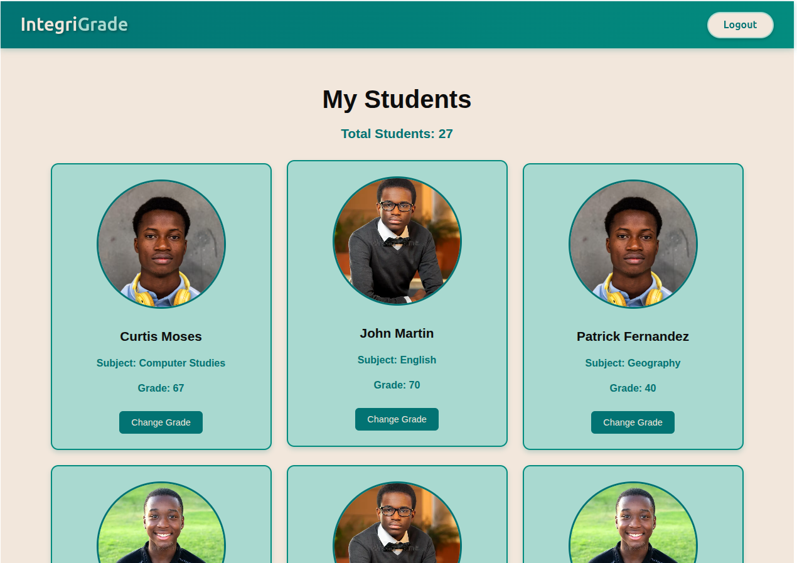

Through the **change grade button** a teacher may be able to grade a student through a form. On logging out, a teacher is routed to the teacher login form. 
## Extra Features
### Form Validations
By use of yup and Formik, the forms in the application validate certain conditions and reveal any violations to those conditions below the input fields. For example, a phone number in signups must start with 0 and be 11 digits long.
### Protected Routes
Unless a classteacher, teacher, guardian or student is logged in, they cannot access their dashboards even if they input the specific routes on the browser to their resources

## How to use
### Requirements
To use this application, you will need a computer,tablet or phone and access to internet
### Technologies Used
- REACT frontend
- Flask and flask packages
- PostgreSQL database- hosted on render
### How to Setup
1. Clone this repository into your machine

       git clone git@github.com:Denniskaranja2023/IntegriGrade_phase_4_project.git
2. Open a terminal to be used for frontend(in client directory)

       cd client
3. Install the required Node packages to be used in the frontend
        
       npm install

4. Run the following command to start the react server and ctrl+click the link to open the frontend in the browser
       
       npm run dev
5. Open another terminal to be used for backend. Create a virtual environment and install all the PYPI packages used in the project

       pipenv install && pipenv shell
6. Run the following commands to start the backend server.
       
       cd server && python app.py
## Contact Information
Collaborations are welcome and communication can be made through the following contacts:

Email: denniswanyeki2021@gmail.com

Phone number: 0711606734

## Licences
### MIT Licence
Copyright (c) 2024 Dennis Karanja

